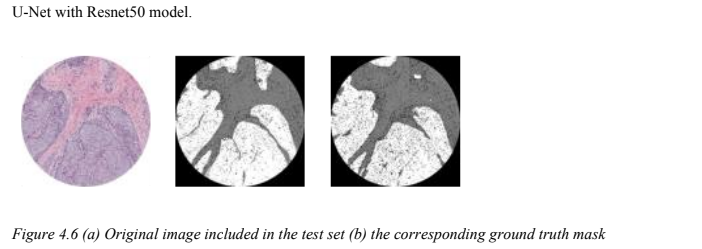
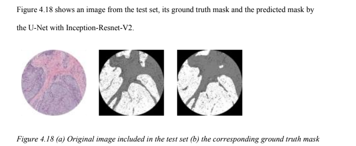
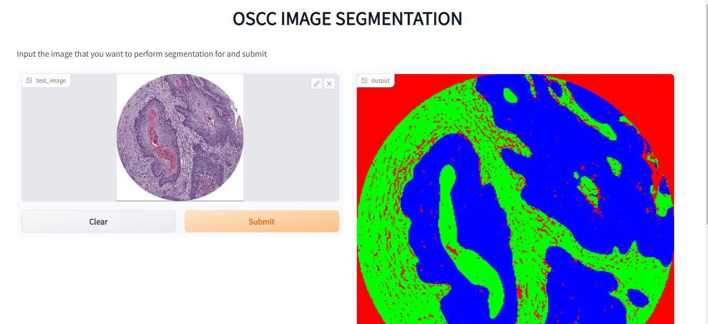
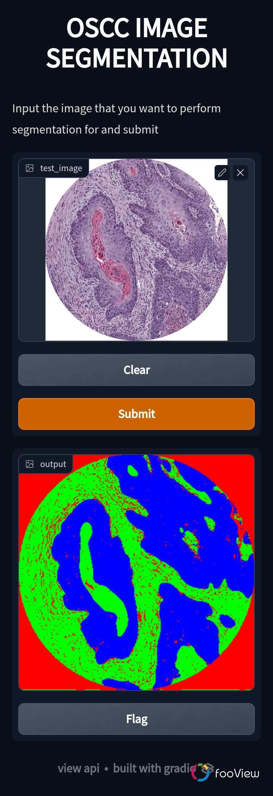

## Project Title

**DeepCancerSegmentation**

## Paper Abstract

Oral Squamous Cell Carcinoma (OSCC) is a very common type of cancer that affects and can
occur anywhere in the oral cavity. The segmentation of carcinoma cells from their non-carcinoma
counterparts using deep learning architectures has been researched in some of the current studies,
but further study is required in this area. In this research, the performance of the U-Net
architecture and five modifications of the U-Net design is experimentally compared for the
segmentation of OSCC images. High-quality Whole Slide Images (WSI) samples from the Oral
Cancer (ORCA) dataset were used. Image augmentation and some other data preprocessing
techniques were also used on the images before they were fed into the deep learning architectures.
The architecture that gave the best performance is the U-Net with Inception-Resnet-v2 with an
IOU score of 0.87, an F1 score of 0.86, a sensitivity of 0.86, and a specificity of 0.93. A key result of this research is that all of the U-Net modifications performed better when compared to the U-
Net architecture.

_**Keywords**: Oral Squamous Cell Carcinoma (OSCC), Oral Cancer dataset (ORCA), Whole Slide
Images (WSI)._

## Some Results

<!--  -->

<!--  -->

## Language and Tools

The Python programming language was used in this project from start to end.

  

<a href="https://www.tensorflow.org" target="_blank" rel="noreferrer"> 
      </a> 

## Table of Contents

## How to install and Run the Project

The program was run on Google colab (Ubuntu 20.04 OS)

## How to Use

You can edit the path variables existing thoughout the files to fit your file organization as many files are created and modified from this project. The entire project was run on google colab with storage on google drive. You can also run on your local instance but you would need a considerablea amount of resources as there are some resource-heavy computations present.

## How to Contribute

If you would love to participate, you can fork this repo and contribute by doing any of the folllowing

> - Optimizing existing solution
> - Writing documentations and comments for notebooks
> - Write tests
> - Add issues to be fixed

## Support

  
